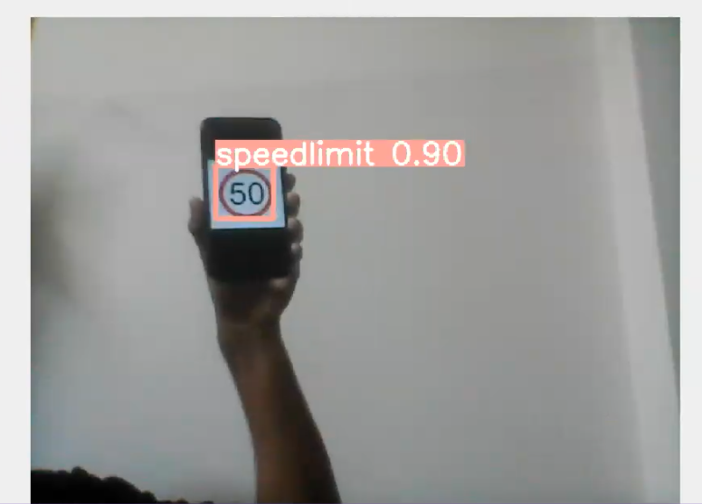

# CSE472-ML-Project-Road-Sign-Detection
This project uses YOLOv8 for road sign detection, trained on a dataset of road sign images. The model is built using PyTorch and is capable of detecting and classifying various types of road signs, with evaluations done using precision, recall, and F1 score metrics.

